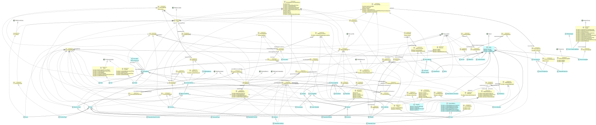

# FamixNG Metamodel for TypeScript.

[](https://github.com/fuhrmanator/FamixTypeScript/actions/workflows/push_ci.yml)

This project is normally synchronized with [FamixTypeScriptImporter](https://github.com/fuhrmanator/FamixTypeScriptImporter) as it is the FamixNG metamodel it supports.

## Metamodel documentation (visualization)

The following was generated by CI.



## Loading from a playground

This version works in Moose 11. 

```st
Metacello new
	githubUser: 'fuhrmanator' project: 'FamixTypeScript' commitish: 'master' path: 'src';
	baseline: 'FamixTypeScript';
	load
```

Note to students: If you're working with a fork of this project, you should change the `githubUser` above to match your fork.

## Loading a FamixTypeScript model (from importer)

Assuming the model is in `entity.json` and you've cloned your repos in the same `GitHub` tree:

```st
'../../../GitHub/FamixTypeScriptImporter/entity.json' asFileReference 
	readStreamDo: [ :stream | model := FamixTypeScriptModel new
	importFromJSONStream: stream. model install ]. 
```
